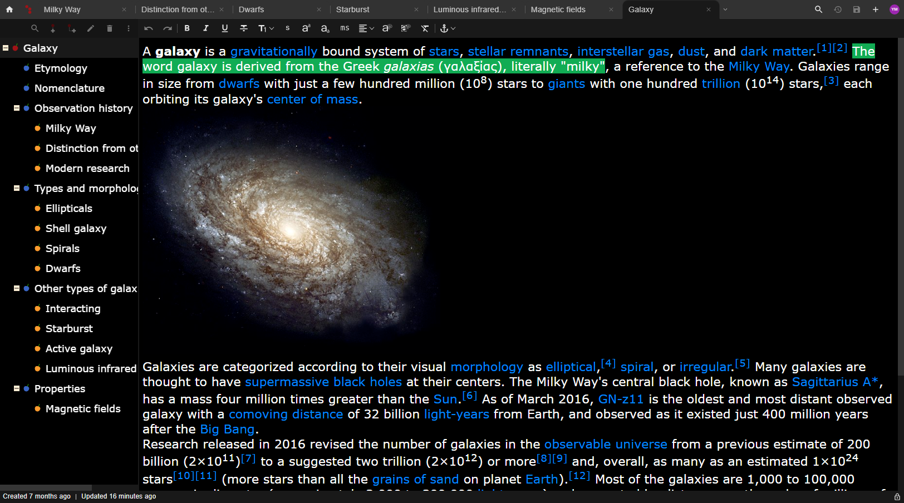

<h1> CherryJuice</h1>
CherryJuice is a hierarchical note-taking web app.
  

### Features

- CherryTree import and export 
- Document sharing (share documents with everyone or with specific users)
- Full-text search
- Offline mode
- Mobile-friendly layout

### Motivation

The initial motivation was the ability to access CherryTree documents from mobile devices.

###  Demo
An online instance is available at [https://cherryjuice.app](https://cherryjuice.app).  
See [screenshots](./screenshots.md) for a quick overview.

> Disclaimer: The app needs to undergo extensive testing and bug fixing before it can be used in the real world.

# Development

Please read [development.md](./development.md) for details on this project.

# Running locally

The app is available as a [Docker image](running-locally.md#docker-image).  

# License
The project is licensed under the [GNU Affero General Public License version 3 (or newer)](https://github.com/ycnmhd/cherryjuice/blob/master/LICENSE).
